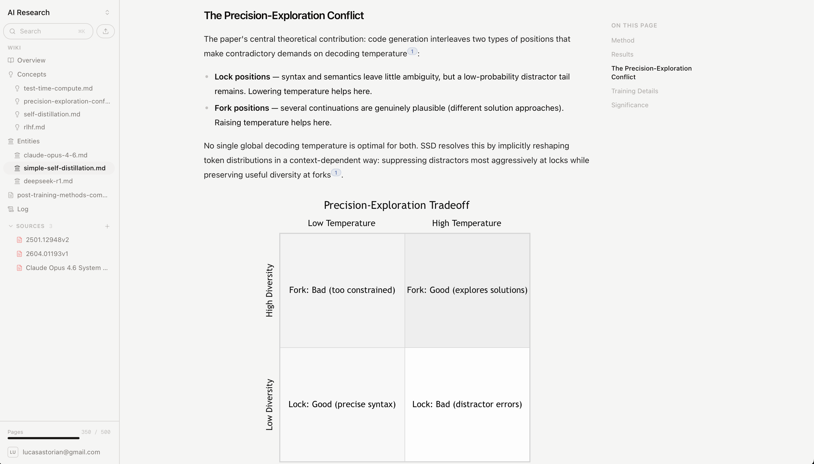

# LLM Wiki

[](https://llmwiki.app)
[](https://opensource.org/licenses/Apache-2.0)

Free, open-source implementation of [Karpathy's LLM Wiki](https://x.com/karpathy/status/2039805659525644595) ([spec](https://gist.github.com/karpathy/442a6bf555914893e9891c11519de94f)). Available at [llmwiki.app](https://llmwiki.app).

1. **Upload sources** — PDFs, articles, notes, office docs. Review them in a full document viewer.
2. **Connect Claude** — via MCP. It reads your sources, writes wiki pages, maintains cross-references and citations.
3. **The wiki compounds** — every source you add and every question you ask makes it richer. Knowledge is built up, not re-derived.



### Three Layers

| Layer | Description |
|-------|-------------|
| **Raw Sources** | PDFs, articles, notes, transcripts. Your immutable source of truth. The LLM reads them but never modifies them. |
| **The Wiki** | LLM-generated markdown pages — summaries, entity pages, cross-references, mermaid diagrams, tables. The LLM owns this layer. You read it; the LLM writes it. |
| **The Tools** | Search, read, and write. Claude connects via MCP and orchestrates the rest. |

### Core Operations

LLM Wiki ships an **MCP server** that Claude.ai connects to directly. Once connected, Claude has tools to search, read, write, and delete across your entire knowledge vault. All operations below happen through Claude — you talk to it, it maintains the wiki.

**Ingest** — Drop a source in. Claude reads it, writes a summary, updates entity and concept pages across the wiki, and flags anything that contradicts existing knowledge. A single source might touch 10-15 wiki pages.

**Query** — Ask complex questions against the compiled wiki. Knowledge is already synthesized — not re-derived from raw chunks each time. Good answers get filed back as new pages, so your explorations compound.

**Lint** — Run health checks. Find inconsistent data, stale claims, orphan pages, missing cross-references. Claude suggests new questions to investigate and new sources to look for.

---

## Architecture

```
┌─────────────┐     ┌─────────────┐     ┌─────────────┐
│   Next.js   │────▶│   FastAPI   │────▶│  Supabase   │
│   Frontend  │     │   Backend   │     │  (Postgres) │
└─────────────┘     └──────┬──────┘     └─────────────┘
                           │
                    ┌──────┴──────┐
                    │  MCP Server │◀──── Claude
                    └─────────────┘
```

| Component | Stack | Responsibilities |
|-----------|-------|------------------|
| **Web** (`web/`) | Next.js 16, React 19, Tailwind, Radix UI | Dashboard, PDF/HTML viewer, wiki renderer, onboarding |
| **API** (`api/`) | FastAPI, asyncpg, aioboto3 | Auth, uploads (TUS), document processing, OCR (Mistral) |
| **Converter** (`converter/`) | FastAPI, LibreOffice | Isolated office-to-PDF conversion (non-root, zero AWS creds) |
| **MCP** (`mcp/`) | MCP SDK, Supabase OAuth | Tools for Claude: `guide`, `search`, `read`, `write`, `delete` |
| **Database** | Supabase (Postgres + RLS + PGroonga) | Documents, chunks, knowledge bases, users |
| **Storage** | S3-compatible | Raw uploads, tagged HTML, extracted images |

---

## MCP Tools

Once connected, Claude has full access to your knowledge vault:

| Tool | Description |
|------|-------------|
| `guide` | Explains how the wiki works and lists available knowledge bases |
| `search` | Browse files (`list`) or keyword search with PGroonga ranking (`search`) |
| `read` | Read documents — PDFs with page ranges, inline images, glob batch reads |
| `write` | Create wiki pages, edit with `str_replace`, append. SVG and CSV asset support |
| `delete` | Archive documents by path or glob pattern |

---

## Getting Started

The fastest way to try LLM Wiki:

1. **Sign up** at [llmwiki.app](https://llmwiki.app) and create a knowledge base
2. **Upload sources** — drop in PDFs, notes, articles
3. **Connect Claude** — go to Settings, copy the MCP config, add it as a connector in Claude.ai
4. **Start building** — tell Claude to read your sources and compile the wiki

That's it. No local setup required.

### Self-Hosting

#### Prerequisites

- Python 3.11+
- Node.js 20+
- A [Supabase](https://supabase.com) project (or local Docker setup)
- An S3-compatible bucket (needed for file uploads)

#### 1. Database

```bash
psql $DATABASE_URL -f supabase/migrations/001_initial.sql
```

Or use local Docker: `docker compose up -d`

#### 2. API

```bash
cd api
python -m venv .venv && source .venv/bin/activate
pip install -r requirements.txt
cp ../.env.example .env  # edit with your credentials
uvicorn main:app --reload --port 8000
```

#### 3. MCP Server

```bash
cd mcp
python -m venv .venv && source .venv/bin/activate
pip install -r requirements.txt
uvicorn server:app --reload --port 8080
```

#### 4. Web

```bash
cd web
npm install
cp .env.example .env.local
npm run dev
```

#### 5. Connect Claude

1. Open **Settings** > **Connectors** in Claude
2. Add a custom connector pointing to `http://localhost:8080/mcp`
3. Sign in with your Supabase account when prompted

#### Environment Variables

**API** (`api/.env`)

```
DATABASE_URL=postgresql://...
SUPABASE_URL=https://your-ref.supabase.co
SUPABASE_JWT_SECRET=          # optional, for legacy HS256 projects
MISTRAL_API_KEY=              # for PDF OCR
AWS_ACCESS_KEY_ID=
AWS_SECRET_ACCESS_KEY=
AWS_REGION=us-east-1
S3_BUCKET=your-bucket
APP_URL=http://localhost:3000
CONVERTER_URL=               # optional, URL of isolated converter service
```

**Web** (`web/.env.local`)

```
NEXT_PUBLIC_SUPABASE_URL=https://your-ref.supabase.co
NEXT_PUBLIC_SUPABASE_ANON_KEY=your-anon-key
NEXT_PUBLIC_API_URL=http://localhost:8000
NEXT_PUBLIC_MCP_URL=http://localhost:8080/mcp
```

---

## Why This Works

The tedious part of maintaining a knowledge base is not the reading or the thinking — it's the bookkeeping. Updating cross-references, keeping summaries current, noting when new data contradicts old claims, maintaining consistency across dozens of pages.

Humans abandon personal wikis because the maintenance burden grows faster than the value. LLMs don't get bored, don't forget to update a cross-reference, and can touch 15 files in one pass. The wiki stays maintained because the cost of maintenance drops to near zero.

The human's job is to curate sources, direct the analysis, ask good questions, and think about what it all means. The LLM's job is everything else.

## License

Apache 2.0
